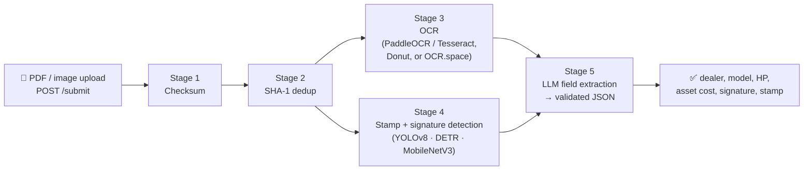

# Loan-Invoice Document AI

<p align="center">
  <a href="https://github.com/lalitofficial/AI-Document-Intelligence-System/actions/workflows/ci.yml"></a>
  <a href="LICENSE"></a>
  
  
  
  
</p>

Automated multilingual invoice parsing for **tractor-loan PDFs**, built for **IDFC FIRST Bank's Convolve 4.0** challenge: an async five-stage pipeline that OCRs scanned invoices, detects dealer **signatures (YOLOv8)** and **stamps (DETR)**, and emits validated JSON — `dealer_name`, `model`, `horse_power`, `asset_cost`, plus signature/stamp presence with bounding boxes — under **CPU-only** constraints.

> **Cost profile:** measured ≈ **$0.002/document** during the challenge, ~5× below the cost ceiling, using local CPU OCR (PaddleOCR/Tesseract), an INT8-quantisable YOLOv8 detector, and a free-tier extraction LLM.

## Pipeline



Each stage is an isolated processor with its own queue, retries, and persisted
stage results (SQLAlchemy + SQLite), so a failed OCR never loses the upload and
every job is resumable and auditable via the API.

## Features

- **Five-stage async pipeline** — checksum → SHA-1 dedup → OCR → stamp/signature detection → structured extraction, orchestrated with worker pools and per-stage status tracking.
- **Pluggable OCR** — `local` (PaddleOCR with Tesseract fallback — CPU-only, zero API cost), `donut` (local transformer), or `thirdparty` (OCR.space) selected by env var.
- **Signature & stamp detection** — YOLOv8 signature detector and DETR-based stamp detector from Hugging Face, with a lightweight MobileNetV3 classifier and a pure-OpenCV image-processing mode for constrained machines.
- **INT8 quantisation** — `scripts/export_int8_yolo.py` exports any YOLOv8 checkpoint (including nano) to INT8 ONNX for fraction-of-a-cent CPU inference.
- **Validated JSON output** — the extraction LLM (OpenRouter, free-tier model by default) is prompted against a strict field schema; fields are typed, fuzzy-matched where appropriate, and `null` when absent.
- **Job API + UI** — FastAPI endpoints (`/submit`, `/status/{email}`, `/job/{job_id}`, `/health`) and a Streamlit front-end for batch uploads and visual review.
- **Visual QA** — `stage4_viz.py` renders detection overlays; `signature_detection.py` doubles as a standalone CLI.

## Getting started

```bash
python3 -m venv .venv && source .venv/bin/activate
pip install -r requirements.txt

# OCR engines for the default local provider (either works):
#   brew install tesseract        # macOS
#   sudo apt install tesseract-ocr
# or: pip install paddlepaddle paddleocr

cp .env.example .env   # set OPENROUTER_API_KEY for stage-5 extraction

python run.py                      # FastAPI on :8000
streamlit run streamlit_app.py    # optional UI
```

### API

| Endpoint | What it does |
| --- | --- |
| `POST /submit` | Upload a PDF/image; returns a job id and queues the pipeline |
| `GET /status/{email}` | All jobs submitted by an email, with per-stage status |
| `GET /job/{job_id}` | Full job detail including extracted JSON |
| `GET /health` | Liveness probe |

### Output schema

```json
{
  "dealer_name": "string or null",
  "model": "string or null",
  "horse_power": 42,
  "asset_cost": 685000,
  "dealer_signature": { "present": true, "bounding_box": { "x": 0, "y": 0, "width": 0, "height": 0 } },
  "dealer_stamp": { "present": false, "bounding_box": null }
}
```

## License

[MIT](LICENSE) © Lalit Kumar
